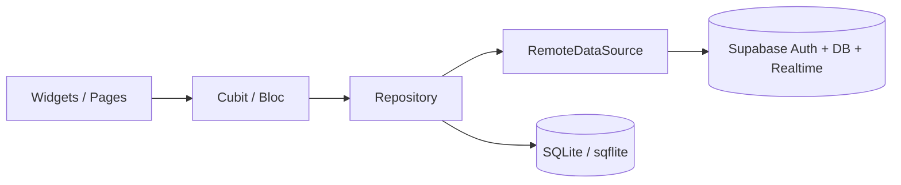

# WhatsUnity

[](https://flutter.dev)
[](https://dart.dev)
[](https://supabase.com)

> Community-centric residential management for compounds and buildings—chat, operations, and social tools in one Flutter client backed by Supabase.

---

## Project overview

**WhatsUnity** helps residents, managers, and administrators collaborate within **multi-compound (community) contexts**: join or switch compounds, participate in **building-wide and general community chat**, submit and track **maintenance, security, and cleaning** requests, browse a **compound social feed**, and use **role-appropriate tools** (for example, manager workflows and an admin dashboard).

The app is built with **Flutter** and uses **Supabase** for authentication, PostgreSQL data access, and **Supabase Realtime** (database change subscriptions over managed infrastructure—not a hand-rolled WebSocket server).

---

## Key features

### Real-time community and building chat

- Messages are stored in Supabase (`messages` and related tables) and loaded via RPC such as `get_messages_with_pagnation` (see [`lib/features/chat/data/datasources/chat_remote_data_source.dart`](lib/features/chat/data/datasources/chat_remote_data_source.dart)).
- **Live updates** use the Supabase client’s **`RealtimeChannel`** with **`onPostgresChanges`** on the `messages` table, filtered by `channel_id`—so clients receive inserts, updates, and deletes through **Supabase Realtime**, not custom WebSockets.
- The chat UI builds on **`flutter_chat_ui`** / **`flutter_chat_core`** with cubit-driven state ([`ChatCubit`](lib/features/chat/presentation/bloc/chat_cubit.dart), [`PresenceCubit`](lib/features/chat/presentation/bloc/presence_cubit.dart)).
- Attachments and rich content often flow through **Google Drive** uploads ([`GoogleDriveService`](lib/core/services/GoogleDriveService.dart)) with complementary processing where configured.
- **Local persistence:** chat history is cached in **SQLite** (`sqflite`) for fast reads, pagination, and an offline-first load path. SharedPreferences is no longer used for message lists. See [Chat persistence (SQLite)](#chat-persistence-sqlite) below.

### Security, cleaning, and maintenance reporting

- Report types are modeled as [`MaintenanceReportType`](lib/core/config/Enums.dart): **maintenance**, **security**, and **careService** (cleaning/care).
- Deeper categories exist per domain (e.g. `MaintenanceCategory`, `SecurityCategory`, `CareServiceCategory`) in the same enums file.
- [`MaintenanceCubit`](lib/features/maintenance/presentation/bloc/maintenance_cubit.dart) and [`ManagerCubit`](lib/features/maintenance/presentation/bloc/manager_cubit.dart) drive resident vs manager flows; reports are loaded from Supabase-backed repositories.

### Multi-compound selection and switching

- Authenticated users can maintain multiple compounds; selection is driven by [`AuthCubit`](lib/features/auth/presentation/bloc/auth_cubit.dart) (e.g. `selectCompound`, `loadCompoundMembers`) and persisted with [`CacheHelper`](lib/core/network/CacheHelper.dart) (e.g. `compoundCurrentIndex`).
- The home experience exposes a **compound dropdown** when multi-compound mode is enabled ([`HomePage`](lib/features/home/presentation/pages/home_page.dart)), so users can switch context without re-login.

### Role-based access control

- Roles are defined in [`Roles`](lib/core/config/Enums.dart): `user`, `manager`, `admin`, `developer`, `owner`, `tenant`.
- Navigation adapts by role: [`MainScreen`](lib/features/home/presentation/pages/main_screen.dart) shows **Home**, **Chats** (hidden for `manager`), **Profile**, and **Admin dashboard** only when `role == admin`, using an [`IndexedStack`](lib/features/home/presentation/pages/main_screen.dart) for tabs.
- [`UserState`](lib/core/config/Enums.dart) governs onboarding gates (e.g. `New`, `underReview`, `approved`) in [`GatekeeperScreen`](lib/features/auth/presentation/pages/gatekeeper_user_page.dart).

### Social feed

- Compound-scoped posts are loaded via [`SocialCubit`](lib/features/social/presentation/bloc/social_cubit.dart) and the social UI in [`Social.dart`](lib/features/social/presentation/pages/Social.dart), alongside the general compound chat tab.

---

## Tech stack

| Layer | Technology |
|--------|------------|
| **UI** | Flutter (Material 3), [`google_fonts`](https://pub.dev/packages/google_fonts), localization via `flutter_localizations` / generated `l10n` |
| **Language** | Dart (^3.7.2) |
| **Backend** | [Supabase](https://supabase.com) (`supabase_flutter`) — Auth, Postgres, Realtime |
| **State management** | **Bloc** / **Cubit** (`flutter_bloc`, `bloc`); [`provider`](https://pub.dev/packages/provider) for narrow cases (e.g. auth readiness) |
| **Chat UI** | `flutter_chat_ui`, `flutter_chat_core`, Flyer chat message packages |
| **Media & device** | `image_picker`, `file_picker`, `permission_handler`, `audioplayers`, etc. |
| **Other** | `dio` / `http`, `shared_preferences`, `sqflite`, `path`, `flutter_dotenv`, Google Sign-In, Firebase Core (as wired in the project) |

---

## Chat persistence (SQLite)

Chat messages are stored on device in a **local SQLite database** (package: [`sqflite`](https://pub.dev/packages/sqflite), paths via [`path`](https://pub.dev/packages/path) and [`path_provider`](https://pub.dev/packages/path_provider)) to avoid large JSON blobs in SharedPreferences and to support **efficient querying**, **LIMIT/OFFSET pagination**, and an **offline-first** first paint.

### Layout (clean architecture)

| Piece | Location |
|--------|----------|
| DB singleton & schema | [`lib/core/services/database_helper.dart`](lib/core/services/database_helper.dart) |
| Local data source (interface + impl) | [`lib/features/chat/data/datasources/chat_local_data_source.dart`](lib/features/chat/data/datasources/chat_local_data_source.dart) |
| Map helpers (`types.Message` ↔ storage) | [`lib/features/chat/data/utils/chat_message_map_codec.dart`](lib/features/chat/data/utils/chat_message_map_codec.dart) |
| Offline-first repository | [`lib/features/chat/data/repositories/chat_repository_impl.dart`](lib/features/chat/data/repositories/chat_repository_impl.dart) |
| UI cache on dispose (batch upsert) | [`ChatCacheService`](lib/features/chat/presentation/widgets/chatWidget/GeneralChat/ChatCacheService.dart) |
| DI: `ChatLocalDataSource` | [`RepositoryProvider`](lib/main.dart) in [`main.dart`](lib/main.dart) |

### Schema (`messages` table)

Columns mirror the Supabase row shape used by [`MessageModel.fromMap`](lib/features/chat/data/models/message_model.dart), including:

- **`id`** (TEXT, primary key) — message UUID.
- **`channel_id`** (INTEGER) — chat channel scope.
- **`author_id`**, **`content`** (text body), **`uri`**, **`type`** (logical type, e.g. text / image / audio).
- **`created_at`** (ISO string), **`created_at_ms`** (INTEGER) — sorting and pagination.
- **`metadata`** (JSON string) — reactions, reply targets, waveform, etc.
- **`sent_at`**, **`deleted_at`** — when present from the server.
- **`is_synced`** (INTEGER 0/1) — reserved for a future **offline outbound queue** (unsynced drafts).
- **`payload_json`** (TEXT) — full row JSON for round-tripping without losing fields.

An index on `(channel_id, created_at_ms)` supports per-channel queries.

### Offline-first fetch flow

1. **`ChatRepository.fetchMessages`** reads the requested **page from SQLite** and returns it immediately to [`ChatCubit`](lib/features/chat/presentation/bloc/chat_cubit.dart).
2. A **background** call loads the same page from **Supabase** (existing RPC `get_messages_with_pagnation`), **upserts** rows into SQLite, then invokes optional **`onRemoteSynced`** so the cubit can **merge** and re-emit [`ChatMessagesLoaded`](lib/features/chat/presentation/bloc/chat_state.dart).
3. **Realtime** handlers (`subscribeToChannel`) **upsert** inserts/updates and **delete** removed rows in SQLite so the cache stays aligned with the server.

### Migrating from older builds

Older versions cached chat in **SharedPreferences** (`chat_messages_<channelId>`). That path is **not** read automatically; first launch after upgrade builds a fresh SQLite cache from network + realtime. Optionally, you can add a one-time migration that reads legacy strings and inserts them via `ChatLocalDataSource.insertMessages`.

---

## Architecture and state management

The codebase follows a **feature-first** layout under [`lib/features/`](lib/features/), with clear boundaries:

- **`auth/`** — Authentication, compound membership, signup/onboarding; [`AuthCubit`](lib/features/auth/presentation/bloc/auth_cubit.dart).
- **`chat/`** — Messages, channels, realtime subscription use cases ([`SubscribeToChannel`](lib/features/chat/domain/usecases/subscribe_to_channel.dart)), [`ChatCubit`](lib/features/chat/presentation/bloc/chat_cubit.dart), [`ChatDetailsCubit`](lib/features/chat/presentation/bloc/chat_details_cubit.dart), [`MessageReceiptsCubit`](lib/features/chat/presentation/bloc/message_receipts_cubit.dart).
- **`maintenance/`** — Reports and manager pipelines; [`MaintenanceCubit`](lib/features/maintenance/presentation/bloc/maintenance_cubit.dart), [`ManagerCubit`](lib/features/maintenance/presentation/bloc/manager_cubit.dart).
- **`social/`** — Posts and related data; [`SocialCubit`](lib/features/social/presentation/bloc/social_cubit.dart).
- **`admin/`** — Administrative tools; [`AdminCubit`](lib/features/admin/presentation/bloc/admin_cubit.dart), [`ReportCubit`](lib/features/admin/presentation/bloc/report_cubit.dart).
- **`profile/`** — User profile; [`ProfileCubit`](lib/features/profile/presentation/bloc/profile_cubit.dart).

Cross-cutting pieces live under [`lib/core/`](lib/core/) (config, theme, network, services). App-wide navigation concerns use [`AppCubit`](lib/Layout/Cubit/cubit.dart) in [`lib/Layout/Cubit/`](lib/Layout/Cubit/).

**Pattern:** Presentation (Cubit/Bloc) → Repository (feature `data/repositories`) → Remote data source (Supabase calls). For chat, the repository also uses a **local data source** (SQLite) for caching and offline-first reads. Domain use cases live under `features/<feature>/domain/usecases/` where extracted.



---

## Getting started

### Prerequisites

- [Flutter SDK](https://docs.flutter.dev/get-started/install) (compatible with Dart ^3.7.2)
- A Supabase project (URL + anon key)
- For full functionality: configured Google / Firebase / Drive integrations as used in your environment (see project-specific setup).

### 1. Clone the repository

```bash
git clone <YOUR_REPO_URL>
cd <YOUR_PROJECT_FOLDER>
```

### 2. Install dependencies

```bash
flutter pub get
```

> **Note:** [`pubspec.yaml`](pubspec.yaml) may reference **private Git dependencies** or **`dependency_overrides`** pointing at local paths (e.g. `../CustomFlutterPackeges/...`). Adjust those entries for your machine or replace them with published packages before building.

### 3. Environment variables

The app loads configuration from **`.env`** at startup ([`main.dart`](lib/main.dart) uses `flutter_dotenv` and lists `.env` under `flutter.assets` in [`pubspec.yaml`](pubspec.yaml)).

Create a `.env` file in the **project root** (same folder as `pubspec.yaml`) with at least:

```env
SUPABASE_URL=https://YOUR_PROJECT.supabase.co
SUPABASE_ANON_KEY=YOUR_SUPABASE_ANON_KEY
```

Never commit real keys to public repositories. Consider adding `.env` to `.gitignore` and sharing a **`.env.example`** with placeholder names only.

### 4. Run the app

```bash
flutter run
```

Choose a device or emulator when prompted.

---
### 5. Local Backend Setup (Docker)

WhatsUnity's backend can be entirely self-hosted using Docker to spin up the full Supabase stack (PostgreSQL, GoTrue, Realtime, Storage) on your local machine.

1. **Clone the official Supabase docker repository** (outside your Flutter project):
   ```bash
   git clone --depth 1 [https://github.com/supabase/supabase](https://github.com/supabase/supabase)
   cd supabase/docker
   ```
   

## Screenshots and design assets

Placeholder slots for product and store listings:

| Asset | Placeholder |
|--------|-------------|
| Feature graphic | `` |
| Phone screenshots | `` |

Replace or extend these paths as your media library grows.

---

## Current status

WhatsUnity is **in Google Play testing** (internal / closed testing as applicable to your release track). Features and APIs may evolve; coordinate backend (Supabase migrations, RLS policies, and RPCs) with mobile releases.

---

## License and contributing

**Copyright © 2026 Nour Adawy. All rights reserved.**

> This repository and its contents are proprietary and confidential. No part of this software—including but not limited to source code, compiled binaries, UI/UX designs, and documentation—may be copied, reproduced, distributed, transmitted, modified, or otherwise used in any form or by any means without the prior explicit written permission of the copyright owner.

This is **not** an open-source project. All rights are exclusively retained by the author.

For questions about architecture or onboarding, prefer documenting decisions next to the relevant `feature/` module and Supabase schema.
